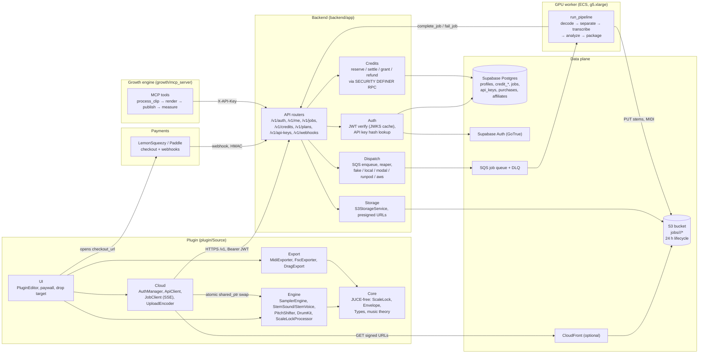
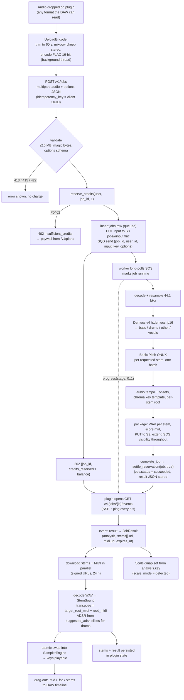
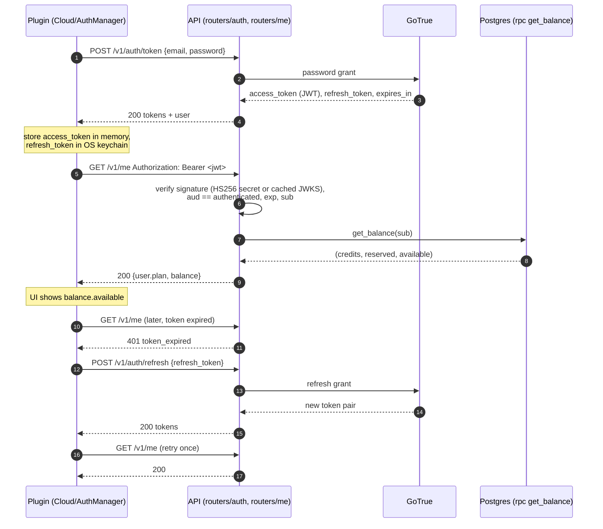
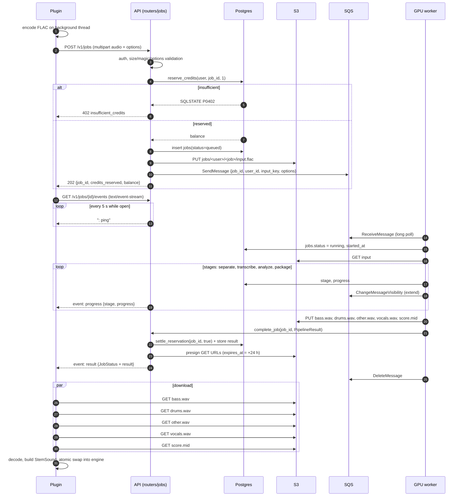
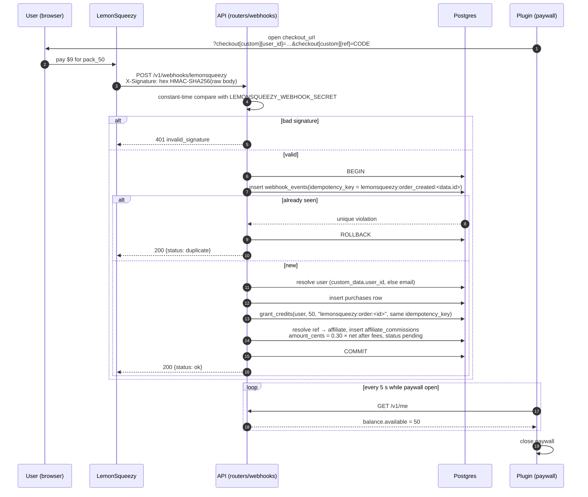
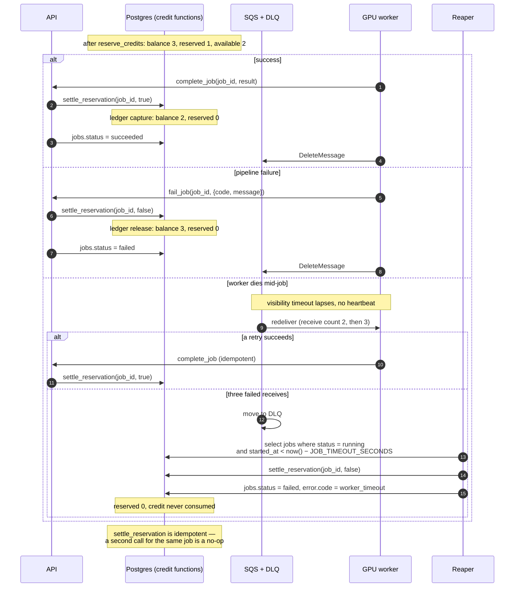
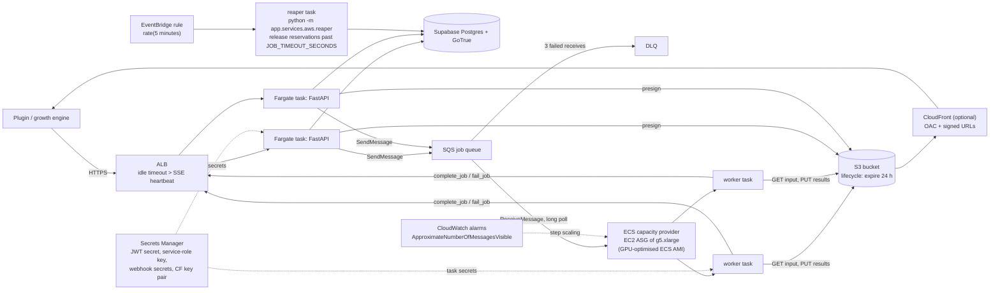

# SnapPlay AI — Architecture

This document describes how the components in the repository fit together. Every
interface it mentions is defined in [`API_CONTRACT.md`](API_CONTRACT.md) (cited as
"§n" below); where this document and the contract disagree, the contract wins.

## 1. Why a hybrid split

The plugin is an instrument. An instrument has to respond to a key press inside one
audio buffer (a few milliseconds), work offline once the sounds are loaded, and never
stall the host's audio thread. Source separation and transcription, on the other hand,
need a GPU: Demucs v4 on a 30 s clip takes seconds on an A10G and minutes on a laptop
CPU, and the models are hundreds of megabytes.

So the split is drawn along latency and hardware, not along "features":

| runs **locally** in the plugin (`plugin/`) | runs in the **cloud** (`backend/`, GPU worker) |
|---|---|
| Playing stems as voices, pitch shifting, Scale-Snap (§8), ADSR, drum slicing from transients | Demucs v4 separation into `bass / drums / other / vocals` |
| FLAC encoding of the drop (§2), upload, SSE consumption, download and decode | Basic Pitch transcription → MIDI (§2 `midi`) |
| Root transposition, `.mid` / `.fsc` export and drag-out (§9) | Tempo, beat, downbeat and key analysis (§2 `analysis`) |
| Paywall UI driven by `/v1/plans` (§3), token storage and refresh (§1) | Credits, ledger, payments, affiliates (§3, §4, §6, §12) |
| Persisting stems and results in plugin state so a session survives the 24 h retention window | Storage of inputs and outputs for 24 h behind signed URLs (§2, §10) |

Consequences:

* **One credit buys one round trip.** After the round trip the plugin owns everything
  it needs; the cloud can delete the files after 24 h and the DAW session still opens.
* **The audio thread never knows the cloud exists.** Stems arrive on a network thread
  and are handed over lock-free (§7 of this document).
* **The server is stateless per request.** All durable state is in Postgres and object
  storage, so the API tier scales horizontally and the GPU tier scales on queue depth.

## 2. Components



Directory responsibilities:

* `plugin/Source/Core` — pure C++20, no JUCE. Pitch-class sets, Scale-Snap (§8),
  envelope analysis, note/slice types. Tested by `plugin/Tests` without JUCE, which
  also guarantees the headers never pull JUCE in.
* `plugin/Source/Cloud` — everything that talks HTTP: GoTrue proxy calls (§1),
  multipart upload of the FLAC (§2), the SSE reader on `juce::WebInputStream`,
  signed-URL downloads, token persistence and refresh.
* `plugin/Source/Engine` — the sampler. Realtime-safe; owns the currently loaded
  stems and voices; applies transposition, Scale-Snap and ADSR.
* `plugin/Source/Export` — `.mid` (SMF type 1, PPQ 480) and `.fsc` writers (§9) and
  the drag-out shim that writes temp files and starts a host drag.
* `plugin/Source/UI` — editor, drop target, progress, paywall (§3).
* `backend/app/routers` — one router per §1–§4 and §11 route group. Auth, credits,
  storage and dispatch are services the routers call.
* GPU worker — `run_pipeline` (§7) plus the transport wrapper selected by
  `SNAPPLAY_PIPELINE`: `fake` for tests, `local` in-process, `modal`, `runpod`, or `aws`
  (SQS long-poll + ECS).
* `db/migrations` — tables, RLS, the `credit_balance` composite and the `SECURITY
  DEFINER` functions of §6: the credit ledger (`reserve_credits`, `settle_reservation`,
  `grant_credits`, `adjust_credits`, `refund_job`, `get_balance`, `expire_credits`), the
  job lifecycle (`create_job` … `reap_stale_jobs`), `record_purchase`, and the API-key
  trio.
* `infra/aws` — Terraform for §10.
* `growth/mcp_server` — MCP tools that drive the public API with an API key (§11).

## 3. End-to-end data flow



Points worth noting:

* The credit is **reserved** before enqueue and **captured** only on success. Failure,
  cancellation (`DELETE /v1/jobs/{id}`, §2) or a dead worker all end in `release`.
* Progress reaches the plugin as SSE `progress` events; the `result` or `error` event
  closes the stream. If the stream drops (token expiry, network), the plugin refreshes
  and falls back to `GET /v1/jobs/{id}` (§2), which returns the same `JobStatus`.
* The plugin keeps a local copy of everything it downloaded; the signed URLs are only
  used once.

## 4. Sequence diagrams

### 4.1 Sign-in and balance



### 4.2 Job submission, SSE progress, download



### 4.3 Payment webhook → credit grant + affiliate commission



### 4.4 Reservation settlement: success, failure, worker death



## 5. Latency budget

Contract §7 fixes the server-side budget on an A10G (`g5.xlarge`) for a 30 s stereo
clip:

| stage | tool | budget |
|-------|------|--------|
| decode + resample to 44.1 kHz | soundfile / torchaudio | 50 ms |
| separate | Demucs v4 `htdemucs`, fp16, CUDA (optional TensorRT) | 900 ms |
| transcribe | Basic Pitch ONNX, per stem in one batch | 400 ms |
| analyze | aubio tempo + onset, chroma template key | 150 ms |
| package | WAV encode, MIDI write, upload to storage | 300 ms |
| **total** | | **≈ 1.8 s** of the 2.0 s target |

A T4 (`g4dn.xlarge`) does not meet this: separation alone is 3–5 s, so a T4
deployment advertises a ~5 s target (§7). `GPU_INSTANCE_TYPE` is a deployment variable,
not a contract guarantee.

What the user actually waits for includes the network. Estimates for a 30 s stereo
clip (assumptions: 44.1 kHz / 16-bit upload FLAC at ~55 % of PCM size, WAV stems at
16-bit; residential connections):

| step | size | at 5 / 10 / 50 Mbit/s up, 25 / 100 Mbit/s down | notes |
|------|------|-----|-------|
| FLAC encode (client, background thread) | 5.3 MB PCM → ≈ 3 MB | 0.1–0.3 s | starts the moment the drop lands |
| TLS + request setup | — | 0.05–0.2 s | connection kept alive across calls |
| upload | ≈ 3 MB | 4.8 / 2.4 / 0.5 s | dominates on slow uplinks |
| queue wait | — | ≈ 0 s with a warm worker; minutes if the GPU tier is scaled to zero | see §9 |
| pipeline | — | 1.8 s | §7 |
| SSE result delivery | ≈ 50 KB | < 0.1 s | |
| download 4 stems + MIDI | 4 × 5.3 MB ≈ 21 MB | 6.8 / 1.7 s | parallel connections |
| decode + swap | — | < 0.1 s | |
| **perceived total** | | **≈ 5–14 s** | of which 2.0 s is the contract budget |

Encoding the upload at 16-bit matters: a 60 s clip at 48 kHz / 24-bit is 17 MB of PCM
and would not fit the 10 MB cap even as FLAC; at 16-bit / 44.1 kHz it lands around 6 MB.
The server resamples to 44.1 kHz anyway.

How the plugin hides the rest:

1. **Encode and upload immediately on drop**, before any confirmation dialog; the
   `idempotency_key` means a repeated drop of the same clip costs nothing.
2. **Stage-level progress** from SSE rather than a spinner: `separate` → `transcribe`
   → `analyze` → `package` reads as motion, and the heartbeat keeps the UI honest.
3. **Show analysis first.** Key, BPM and Scale-Snap are in the `result` event and are
   applied before a single stem byte has downloaded.
4. **Per-stem readiness.** Each stem is decoded and swapped into the engine as its
   download completes; the keyboard lights up stem by stem instead of all-or-nothing.
5. **Parallel downloads** (one connection per stem plus one for MIDI).
6. **Local drum slicing** from `transients_seconds` if the server sent no `slices`,
   so drum mode does not wait on anything but the drum WAV.
7. **Balance is pre-fetched** at session start (`GET /v1/me`) so the paywall decision
   never adds a round trip to the drop.

## 6. AWS topology (§10)



* **Control plane: Fargate + ALB, not API Gateway + Lambda.** §2 requires
  `text/event-stream` with a `: ping` every 5 s. API Gateway HTTP APIs buffer responses
  and do not support SSE, and their integration timeout is 29 s; Lambda response
  streaming only works through function URLs, which would put a second host, a second
  auth path and a second TLS name in front of the plugin. A long-lived FastAPI process
  behind an ALB handles SSE and WebSockets (§2) natively; the ALB idle timeout is set
  above the heartbeat interval. Fargate also keeps the JWKS cache and rate-limit state
  warm instead of re-fetching on every cold start.
* **Queue: SQS standard + DLQ.** `POST /v1/jobs` enqueues after `create_job` has
  reserved the credit. Workers long-poll, extend visibility while running, and call
  `complete_job` / `fail_job` idempotently. `maxReceiveCount = 3` routes poison
  messages to the DLQ. Ordering is irrelevant (each job is independent), so a FIFO queue
  is not needed.
* **GPU tier: ECS on EC2, scaled on queue depth.** A capacity provider (managed scaling
  at 100 % target, managed termination protection) over an auto-scaling group of
  `GPU_INSTANCE_TYPE` instances (Terraform `var.gpu_instance_type`, default
  `g5.xlarge`). Worker tasks are step-scaled from CloudWatch alarms on
  `ApproximateNumberOfMessagesVisible`: +1 task at one visible message, +2 from five,
  and back down to `worker_min_capacity` after ten minutes with nothing visible or
  in flight. Managed termination protection keeps an instance alive while it still runs
  a task. Fargate has no GPU, so this tier is EC2.
* **Storage: S3 with a 24 h lifecycle rule.** Objects under
  `jobs/<user_id>/<job_id>/`; presigned GET URLs valid until `expires_at`. Setting
  `S3_ENDPOINT_URL` points the same code at Cloudflare R2 (free egress). CloudFront
  with OAC and signed URLs is optional and changes nothing client-side: `stems[].url`
  is an opaque URL either way.
* **Reaper.** An EventBridge rule (`rate(5 minutes)`, `var.reaper_schedule_expression`)
  runs a one-off Fargate task on the API image with the command overridden to
  `python -m app.services.aws.reaper`. It selects jobs `running` longer than
  `JOB_TIMEOUT_SECONDS` and settles them as failed, so a dead worker never silently
  consumes a credit. `infra/supabase/cleanup.sql` gives non-AWS deployments the same
  guarantee from inside the database.
* **Secrets** are in Secrets Manager and injected as ECS task secrets; nothing secret
  is in the image, in Terraform variables or in logs (see `SECURITY.md`).

Config keys (§10): `AWS_REGION`, `S3_BUCKET`, `S3_ENDPOINT_URL`, `CLOUDFRONT_DOMAIN`,
`CLOUDFRONT_KEY_PAIR_ID`, `SQS_JOB_QUEUE_URL`, `SQS_DLQ_URL`, `JOB_TIMEOUT_SECONDS`,
`GPU_INSTANCE_TYPE`.

## 7. Plugin threading model and the lock-free stem handoff

| thread | owner | may it block? | what it does |
|--------|-------|---------------|--------------|
| audio | host | **never** | `processBlock`: read MIDI, snap pitches (`plugin/Source/Core/ScaleLock.h`), render voices from the current `StemSound`s, apply ADSR. No allocation, no locks, no I/O. |
| message | JUCE | yes | UI, parameter changes, drag-out initiation, deferred deletion of retired stem buffers. |
| network | `Cloud` | yes | FLAC encode, multipart upload, SSE read loop (`juce::WebInputStream`), signed-URL downloads, token refresh. |
| decode | `Cloud` / `Engine` | yes | WAV → `juce::AudioBuffer<float>`, envelope and root analysis fallbacks, slice tables. |

Handoff rules:

* A loaded stem is an **immutable** `StemSound` (sample buffer, root, ADSR, slices).
  It is built entirely off the audio thread.
* Publication is a single `std::atomic<std::shared_ptr<StemSound>>` per stem slot.
  The decode thread `store`s (release); the audio thread `load`s (acquire) once per
  block and renders from that pointer for the whole block. Voices already playing keep
  their own copy of the pointer until they finish, so a swap never cuts a note.
* The pointer the audio thread replaces is not freed there: the decode thread keeps
  the previous `shared_ptr` alive in a retire list that the message thread drains after
  a grace period, so the last reference never drops on the audio thread.
* Parameters (`scale_mode`, `scale_root`, `target_root_midi`, ADSR overrides) are
  `std::atomic` values read once per block; MIDI note-offs use the pitch their note-on
  was snapped to, even if the mode changed while held (§8).
* Progress and errors from the network thread reach the UI through a
  `juce::AbstractFifo` of small POD events drained on a message-thread timer, never
  through callbacks into UI code from the network thread.

## 8. Storage layout and retention

```
s3://<S3_BUCKET>/jobs/<user_id>/<job_id>/
    input.<ext>           what the client uploaded, named after the sniffed container
                          (flac from the plugin; wav / mp3 / ogg / aiff are accepted too)
    bass.wav  drums.wav  other.wav  vocals.wav
    score.mid             SMF type 1, PPQ 480
```

The `JobResult` itself is **not** an object: the URLs are signed once when the result is
assembled at completion, and `complete_job(p_job_id, p_result)` stores the whole result —
signed URLs and all — in `jobs.result` (§6). `GET /v1/jobs/{id}` returns that stored copy,
so `stems[].url` stops working at `expires_at` even though the row survives. The plugin
keeps its own copy under
`<user application data>/SnapPlay/jobs/<job_id>/` (`result.json`, the stem WAVs and
`score.mid`), which is what `JobClient::loadCachedJob` reloads without a credit.

* The same layout is used by Supabase Storage in the non-AWS path (§2) and by R2 via
  `S3_ENDPOINT_URL` (§10).
* A bucket lifecycle rule deletes objects 24 h after creation; `expires_at` in the
  `JobResult` matches, and presigned URLs expire at the same instant. After that, `GET
  /v1/jobs/{id}` still returns the job's metadata and analysis, but `stems[].url` is
  dead. This is by design: the plugin persists downloaded stems and the result in its
  own state (or a local cache it owns), and a DAW session never depends on the bucket.
* Nothing user-identifying beyond the UUIDs is in the key, and every object is under
  the owner's prefix, so a leaked URL exposes at most one file of one job.

## 9. Scaling and cost levers

| lever | effect | trade-off |
|-------|--------|-----------|
| Always-on GPU (min 1 instance) | queue wait ≈ 0, 2.0 s budget holds | fixed ≈ $24/day on `g5.xlarge` on-demand (see `ECONOMICS.md`) |
| Scale to zero on ECS | no idle cost | first job after idle waits minutes (instance boot + multi-GB image pull + model load); unacceptable for the product promise without a warm pool |
| Serverless GPU (`modal` / `runpod` backends, §7) | per-second billing, cold starts in tens of seconds | slightly higher $/s; a keep-warm container costs the same as always-on |
| Spot for the GPU ASG | large discount on the fixed floor | interruption mid-job → SQS redelivery + reaper handle it, the user sees a longer wait |
| Scheduled scale (peak hours only) | halves the floor | off-peak users hit cold starts |
| `g4dn.xlarge` (T4) instead of `g5.xlarge` | ≈ 48 % cheaper per hour | ~5 s target instead of 2.0 s |
| R2 or CloudFront in front of S3 | egress ≈ 0 | one more component; R2 needs `S3_ENDPOINT_URL` |
| Batch several jobs per Demucs call | higher GPU utilisation at volume | adds queue wait; only worth it above thousands of jobs/day |
| More Fargate tasks | more concurrent SSE streams | rate-limit and JWKS state must be shared, not per-task |

## 10. Failure modes and recovery

| failure | what the user sees | recovery |
|---------|--------------------|----------|
| Upload rejected (413 / 415 / 422) | error in the drop zone, balance unchanged | nothing was reserved (validation precedes `reserve_credits`, §2) |
| Enqueue fails after reservation | 503 `worker_unavailable` | the route releases the reservation in the same request |
| Worker crashes or is pre-empted mid-job | progress stalls, then `queued` again | SQS redelivers (up to 3); `complete_job` is idempotent so a late duplicate is harmless; after the third failure the message is in the DLQ and the reaper releases the credit |
| Job exceeds `JOB_TIMEOUT_SECONDS` | `error.code = worker_timeout` | reaper settles as failed, credit released; plugin offers a retry (new job, new reservation) |
| GPU capacity unavailable | jobs stay `queued`, SSE keeps pinging | ASG scales on queue depth; if the wait crosses the timeout, jobs fail and credits release |
| SSE connection drops | progress freezes | plugin reconnects; if `401 token_expired`, it refreshes first; `GET /v1/jobs/{id}` catches up the state |
| Access token expires mid-session | transparent | refresh token → new pair (§1); one retry per request |
| Signed URL expired (> 24 h) | download 403 | plugin uses its local copy; if none, the user re-runs (a new credit, since the server has deleted the result) |
| Webhook delivered twice | nothing | idempotency key in `webhook_events`; `grant_credits` and the commission share it (§4, §12) |
| Webhook never arrives | paywall keeps polling `/v1/me` | provider retries; support can call `grant_credits` with the provider's order id as the idempotency key |
| Postgres unavailable | 500 / 503 | the API is stateless; Fargate tasks keep serving once the database returns; no partial credit state because every mutation is one function under row lock |
| Double submit (double click, retry after timeout) | one job | `idempotency_key` returns the existing job, no second reservation (§2) |
| Rate limit hit | 429 with `Retry-After` | plugin backs off; `X-RateLimit-Remaining` drives the UI |
| Payment refund / chargeback | credits reversed | `refund_job` / ledger `adjust`; the affiliate commission for that purchase is set to `void` |
