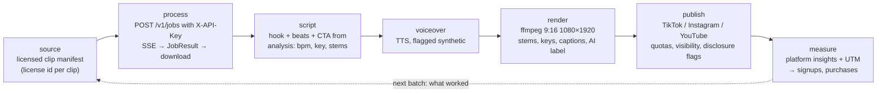
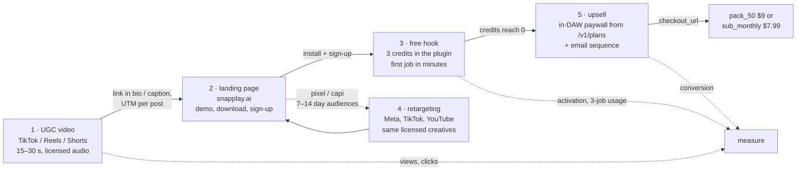

# SnapPlay AI — Growth engine

`growth/` is an automation engine that produces short-form videos showing SnapPlay AI
turning a clip into a playable instrument, publishes them, and measures what they
bring in. It drives the public API with an API key (contract §11) exactly like any
other machine client, so every clip it processes is a real, credit-metered job. It
exposes its steps as MCP tools (`growth/mcp_server`) so an operator — or a scheduled
batch — can run the pipeline one step at a time or end to end.

Read §2 before anything else. The pipeline's default behaviour is shaped by it.

## 1. Pipeline

| step | input | output | side effects |
|------|-------|--------|--------------|
| **source** | the licensed clip manifest under `growth/` (path, license id, licensor, permitted uses, attribution) | a clip that is cleared for advertising use | none — read-only |
| **process** | clip + `options` (stems, `drum_slices`, `target_root_midi`) | `JobResult` (§2) and local copies of stems + MIDI | one credit from the key owner's balance |
| **script** | `analysis` (BPM, key, downbeats), which stems came out strongest, a hook style | a 15–30 s script: hook line, 3–5 beats aligned to `downbeats_seconds`, CTA, caption, hashtags | none |
| **voiceover** | script text, a voice id | audio track, duration, `is_synthetic = true` | TTS provider usage |
| **render** | job result, script, voiceover, a template | 9:16 MP4 with the original clip, the separated stems lighting up per keyboard region, captions, the AI-generated label baked into the metadata and the license id in the file's comment tag | CPU time |
| **publish** | rendered file, platform, caption, visibility, disclosure flags, UTM-tagged link | platform post id and URL | a public (or private, see §5) post; counts against per-platform quotas |
| **measure** | since-timestamp | per-post views, likes, shares, comments, link clicks; landing sessions, signups, purchases by UTM | none |

Everything the engine renders is derived from a job the product actually ran; there
is no faked output.

## 2. Rights: what may be used as a source

**Publishing output derived from a commercial recording as advertising is copyright
infringement.** It does not matter that the recording was separated into stems,
transposed, sliced or played back as an "instrument"; the result is a derivative work
of both the sound recording (the master) and the underlying composition, and using it
in a promotional video is a public performance, a reproduction and a synchronisation
that the rights holders have not licensed. Fair use does not cover advertising.
Platforms detect this automatically (Content ID on YouTube, Rights Manager on Meta,
TikTok's audio matching): the creative is removed, the post is muted or taken down,
repeat matches get the account restricted, and ad accounts running such creatives are
banned — usually without a route back. That outcome is worse for the brand than
publishing nothing.

Therefore:

* **`list_source_clips` returns only clips from the licensed manifest.** Every entry
  carries a license record (type, licensor, license or invoice id, permitted uses
  including "advertising / promotional use" and "derivative works / stems", attribution
  requirement). A clip with no record is not a source.
* **`process_clip` refuses a clip whose license does not permit advertising use or
  derivative works.** The refusal is the default; overriding it is not a tool
  parameter.
* **Acceptable sources**, in order of preference:
  1. Recordings made for this purpose by the team (full ownership).
  2. Clips commissioned from producers under a written buy-out covering advertising
     and derivative use.
  3. Public-domain and CC0 material.
  4. Royalty-free libraries whose license text explicitly allows use in paid
     advertising **and** processing into derivative works (many "royalty-free" packs
     forbid redistributing the audio as stems or samples; the video is a derivative
     work, so read the clause rather than the marketing page). Keep the license text
     and invoice next to the manifest entry.
  5. Users' own recordings, only with a written release naming advertising use.
* **Platform sound libraries are not a licence for ads.** The general TikTok /
  Instagram music libraries cover organic personal posts; business accounts are
  restricted to the commercial libraries, and API-published content that uses a
  library track is muted or rejected. The engine renders its own audio and never picks
  a platform track.
* **Attribution** (CC-BY and similar) is written into the caption by `write_script`
  from the manifest field; it is not optional.
* **Trademarks.** DAW names and screenshots (FL Studio, Ableton Live, Logic) may appear
  to state compatibility, not to imply endorsement; the publishers' brand guidelines
  apply and their logos are not used as design elements.
* **Nothing "found".** No clips from streaming services, sample-sharing sites, other
  creators' videos, or "a song everyone knows" — including for "testing".

## 3. MCP tool surface (`growth/mcp_server`)

The server authenticates to the API with `SNAPPLAY_API_KEY` from the environment
(§11); it never handles user JWTs. Every tool that spends credits or publishes takes
`dry_run`.

| tool | purpose | key inputs | returns | guardrails |
|------|---------|-----------|---------|------------|
| `list_source_clips` | enumerate cleared source material | optional `tag`, `license_type`, `limit` | clips with `clip_id`, duration, tags and the full license record | reads the manifest only; clips without a license record are never listed |
| `process_clip` | run a clip through the product | `clip_id`, `options` (§2 `options` JSON), `dry_run` | `job_id`, `JobResult`, local paths of stems + MIDI, `credits_charged`, `balance_after` | refuses clips whose license forbids ads or derivatives; stops when the owner's `balance.available` is below the configured floor; uses `idempotency_key` = hash(clip, options) so a re-run is free |
| `write_script` | turn a result into a story | `job_id`, `hook_style`, `length_s`, target platform | hook, timed beats, CTA, caption (with attribution), hashtags, on-screen text | never claims unmeasured results ("10× faster"); never presents the presenter as a customer |
| `generate_voiceover` | synthesise narration | script, `voice_id`, `language` | audio file, duration, `is_synthetic = true` | the synthetic flag is carried to `render_video` and `publish_video`; cloned voices of real people are out of scope |
| `render_video` | produce the post | `job_id`, script, voiceover, `template`, `aspect` (default 9:16) | MP4 path, duration, embedded AI-generated label and license id, thumbnail | audio is the licensed clip and its stems only; the AI label cannot be disabled when a voiceover or presenter is synthetic |
| `publish_video` | post it | video path, `platform`, caption, `visibility`, `disclosure` (AI-generated, own-brand promotion), UTM parameters, `scheduled_at`, `dry_run` | platform post id, URL, resulting visibility, quota remaining | honours §5 quotas and audit state; sets the platform's AI-generated and promotional-content flags; refuses a video without a license id |
| `report_metrics` | close the loop | `since`, optional `platform`, `batch_id` | per-post platform metrics, landing sessions, signups, purchases by UTM; a per-batch summary | read-only; metrics come from official insight APIs and the product's own tables |
| `run_daily_batch` | orchestrate | `n_clips`, platforms, `hook_styles`, `credit_budget`, `dry_run` | `batch_id`, per-item outcomes, credits used, items skipped with reasons (license, quota, balance floor) | stops at `credit_budget` or the balance floor, whichever first; respects remaining platform quota; never exceeds 10 submissions / minute (§5) |

`run_daily_batch` is the only tool a scheduler calls; the others exist so an operator
can re-run one stage (a new script for an existing job, a re-render with another
template) without paying for another job.

## 4. The five-touch funnel

| touch | what happens | metric |
|-------|--------------|--------|
| 1 · UGC video | the engine's post: a real clip becomes a playable instrument in under a minute of screen time | views, completion rate, link clicks |
| 2 · landing page | UTM per post; the page shows the same workflow and the download / sign-up | sessions, sign-up rate by post |
| 3 · free hook | 3 credits at signup (§3); the plugin's first-run flow gets the user to a first job fast | activation (first job), jobs per free user |
| 4 · retargeting | landing visitors who did not sign up, and free users who did not run a job, see the same creatives on paid placements | cost per sign-up, cost per activation |
| 5 · upsell | at `available = 0` the plugin shows the `/v1/plans` prompt and polls `/v1/me` (§3); an email sequence mirrors it for users who closed the plugin | free → paid conversion, pack vs sub mix |

`ECONOMICS.md` §9 puts numbers on this: reaching $135 / day needs on the order of 500
sign-ups a day at a 3 % conversion, which is what this funnel has to deliver.

## 5. Platform constraints

| platform | publishing route | before app review / audit | quotas and rules |
|----------|------------------|---------------------------|------------------|
| **TikTok** | Content Posting API (direct post) with the `video.publish` scope | unaudited apps can only post with **private (self-only) visibility**; public posting requires the app audit | per-user daily post limits; the required posting UX (creator info, privacy choice, disclosure toggles) must be honoured even when automated; content-promotion and own-brand disclosure flags set on every post; AI-generated flag set when applicable |
| **Meta (Instagram / Facebook)** | Instagram Graph API content publishing (Reels) via a professional account linked to a Page | `instagram_content_publish` needs **advanced access through app review** | **25 API-published posts per account per 24 h**; platform rate limits per user per hour; AI-info label on synthetic media |
| **YouTube** | Data API `videos.insert` (Shorts are ordinary vertical uploads) | uploads from **unverified API projects are set to private**; the compliance audit lifts this | default **10,000 quota units / day**; `videos.insert` costs 1,600 → about 6 uploads / day per project without a quota extension; the "altered or synthetic content" disclosure at upload |
| **Ad platforms** (retargeting) | Meta / TikTok / Google ads managers | business verification | music in ads must be licensed (§2); no misleading performance claims; creatives reviewed per platform policy |

`publish_video` reads the audit state and quota remaining per platform from
configuration and its own log, and reports the visibility it actually obtained rather
than the one requested. During the review period the engine still runs end to end —
private posts are useful for QA — but the funnel's touch 1 is effectively off until
audits pass, and the launch plan should assume weeks for them.

## 6. Disclosure

* **Synthetic presenters and voices are labelled.** Anything with a TTS voiceover or a
  generated presenter carries the platform's AI-generated flag (TikTok's AI content
  label, YouTube's synthetic-content disclosure, Meta's AI info label) and a visible
  on-screen line. The label is set by `render_video` and `publish_video` from the
  `is_synthetic` flag and cannot be switched off by a caption edit.
* **No fake testimonials.** A synthetic presenter may explain the product; it may not
  claim to be a user, describe "my experience", or read a review. The FTC's rule on
  consumer reviews and testimonials prohibits fabricated or AI-generated testimonials
  and the Endorsement Guides require endorsements to reflect real experience. Real
  user quotes are used only with permission and only verbatim.
* **Own-brand promotion is disclosed** where the platform has a flag for it (TikTok's
  disclosure toggles; "paid partnership" tools elsewhere are for third parties and are
  not used for first-party content).
* **EU audiences.** The AI Act's transparency obligations for AI-generated and
  manipulated media (Article 50, applicable since August 2026) require the same
  labelling; the engine applies it everywhere rather than geo-targeting the label.
* **Claims are measured claims.** "2 seconds" is the A10G pipeline budget (§7), not the
  wall-clock the viewer will experience; scripts say "seconds", show the real elapsed
  time in the recording, and never quote a number the engine has not observed.

## 7. Measurement and attribution

* Every post gets a unique UTM set (`utm_source` = platform, `utm_medium` = ugc,
  `utm_campaign` = batch id, `utm_content` = post id). The landing page records the
  UTM in the sign-up so `report_metrics` can join platform insights to `profiles`,
  `jobs` and `purchases` (through the API, never with a database credential).
* The metric that decides what the next batch makes is **sign-ups per 1,000 views by
  hook style and source clip**, followed by activation rate; views alone are not
  optimised.
* Metrics are pulled from the official insight endpoints of each platform; nothing is
  scraped.

## 8. Operating limits

* The engine's API key belongs to a dedicated account whose balance is topped up
  deliberately; `run_daily_batch` stops at its `credit_budget` and at a balance floor,
  and the key can be revoked with `DELETE /v1/api-keys/{id}` (§11).
* It is subject to the same rate limits as any user (§5): 10 submissions / minute,
  60 reads / minute. A batch of 20 clips takes minutes, not seconds, by design.
* The key is read from the environment only; it appears in no log, config file or
  rendered video metadata.
* CI runs the engine against mocked platform APIs and the backend's `fake` pipeline.
  Real publishing needs the accounts, app reviews and audits in §5.
