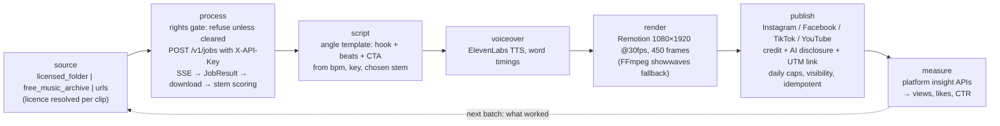
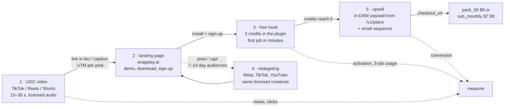

# SnapPlay AI — Growth engine

`growth/` is an automation engine that produces short-form videos showing SnapPlay AI
turning a clip into a playable instrument, publishes them, and measures what they
bring in. It drives the public API with an API key (contract §11) exactly like any
other machine client, so every clip it processes is a real, credit-metered job. It
exposes its steps as MCP tools (`growth/mcp_server`) so an operator — or a scheduled
batch — can run the pipeline one step at a time or end to end.

Read §2 before anything else. The pipeline's default behaviour is shaped by it.

## 1. Pipeline



| step | input | output | side effects |
|------|-------|--------|--------------|
| **source** | one of three providers: `licensed_folder` (audio under `LICENSED_CLIPS_DIR`, each clip's licence read from its manifest entry — §2), `free_music_archive`, or explicit `urls` | candidate clips with the licence each one actually carries, or `rights.status = "unknown"` | none — read-only |
| **process** | clip path/URL + `options` (contract §2 `options`, plus `source`, `license`, `attribution` and `force`) + optional `license_attestation` | a content item: its rights record, `JobResult` (§2), local stems + MIDI, and the stem `scoring.py` picked | one credit from the key owner's balance — but only after the rights gate passes (§2) |
| **script** | clip metadata (title, chosen stem, BPM, key, note count) + an angle | a 15 s brief: hook, timed beats, on-screen text, CTA, caption, hashtags — filled from templates, no LLM call | none |
| **voiceover** | narration text, a voice id | mp3 plus word timings from ElevenLabs `with-timestamps` | TTS provider usage |
| **render** | content item, script, voiceover, scene and presenter choice | 1080×1920 MP4, 450 frames at 30 fps, via `npx remotion render` (FFmpeg `showwaves` + `drawtext` fallback) | CPU time |
| **publish** | content item, platforms, caption, hashtags, optional `schedule_at` | per-platform post id, URL, resulting visibility and the UTM-tagged link the caption carries | a post (private on an unaudited TikTok app, see §5) carrying the licence credit, the AI disclosure (§6) and the campaign link (§7); counts against the configured daily cap |
| **measure** | since-timestamp | per-post views, likes, comments, shares, impressions and a CTR, stored on the content item | none |

Everything the engine renders is derived from a job the product actually ran; there
is no faked output.

## 2. Rights: what may be used as a source

**Publishing output derived from a commercial recording as advertising is copyright
infringement.** It does not matter that the recording was separated into stems,
transposed, sliced or played back as an "instrument"; the result is a derivative work
of both the sound recording (the master) and the underlying composition, and using it
in a promotional video is a public performance, a reproduction and a synchronisation
that the rights holders have not licensed. Fair use does not cover advertising.
Platforms detect this automatically (Content ID on YouTube, Rights Manager on Meta,
TikTok's audio matching): the creative is removed, the post is muted or taken down,
repeat matches get the account restricted, and ad accounts running such creatives are
banned — usually without a route back. That outcome is worse for the brand than
publishing nothing.

Therefore:

* **No provider invents a licence.** The `licensed_folder` provider lists what the operator
  put under `LICENSED_CLIPS_DIR` and reads each clip's licence from the manifest the operator
  wrote (below); a clip with no manifest entry is reported with `rights.status = "unknown"`.
  The `free_music_archive` provider filters on the FMA's own `license_title` with
  `license_allows_ads()`: CC0, public domain, CC BY and CC BY-SA pass; anything matching
  NonCommercial or NoDerivatives is dropped. The `urls` provider records `"unknown"` unless
  the caller passes a `license_attestation` — a URL is not evidence of a licence.
* **`process_clip` refuses what is not cleared, before it spends a credit.** It resolves the
  clip's rights (`mcp_server/licensing.py`) and raises `rights not established for <ref>` —
  naming the status, the licence it found, why the clip is refused, what is missing and how to
  supply it — for anything whose status is not `cleared`. Nothing is uploaded, no job is
  submitted, no content item is created. The licence and attribution it *did* clear are stored
  on the content item, and `publish_video` puts the credit line in the caption of every post.
* **The manifest**, one of two equivalent formats (the per-file one wins when both exist):

  ```jsonc
  // licensed_clips/night-loop.wav.license.json
  { "title": "Night Loop",
    "license": "commissioned buy-out (advertising + derivative use)",
    "attribution": "Producer A",          // optional; becomes the caption's credit line
    "permits_advertising": true,          // optional; false blocks the clip
    "evidence": "contracts/2026-03-night-loop.pdf" }   // free-form, for your own records
  ```

  ```jsonc
  // licensed_clips/licences.json — keyed by file name, flat or under "clips"
  { "clips": { "night-loop.wav": { "license": "CC BY 4.0",
                                   "attribution": "A — https://freemusicarchive.org/…" } } }
  ```

  An entry clears a clip when it names a non-empty `license`, does not set
  `permits_advertising: false`, and does not name a NonCommercial or NoDerivatives licence.
  The older `<name>.json` sidecar is still read and counts as an entry when it names a
  `license`. Writing the entry is the affirmative act: the engine records what you assert and
  where it read it (`rights.evidence`), it does not verify your contract.
* **The override.** `process_clip(..., license_attestation={"license": …,
  "permits_advertising": true, "authority": …, "attribution": …})` clears a clip whose rights
  the engine cannot see — a URL you licensed directly, a file outside the folder. All three of
  `license`, `permits_advertising: true` and `authority` (who granted it, where the paperwork
  lives) are required, the record is stored with `evidence: "operator attestation (<authority>)"`,
  and it is never a default: leaving the argument out means the clip is refused.
* **Acceptable sources**, in order of preference:
  1. Recordings made for this purpose by the team (full ownership).
  2. Clips commissioned from producers under a written buy-out covering advertising
     and derivative use.
  3. Public-domain and CC0 material.
  4. Royalty-free libraries whose license text explicitly allows use in paid
     advertising **and** processing into derivative works (many "royalty-free" packs
     forbid redistributing the audio as stems or samples; the video is a derivative
     work, so read the clause rather than the marketing page). Keep the license text
     and invoice next to the manifest entry.
  5. Users' own recordings, only with a written release naming advertising use.
* **Platform sound libraries are not a licence for ads.** The general TikTok /
  Instagram music libraries cover organic personal posts; business accounts are
  restricted to the commercial libraries, and API-published content that uses a
  library track is muted or rejected. The engine renders its own audio and never picks
  a platform track.
* **Attribution** (CC-BY and similar) is carried on the rights record and appended to every
  caption by `publish_video` as `Audio: <attribution> (<licence>)`, on every platform, from
  what the content item stores — not from what the caller remembers to type. Where a licence
  needs a credit, put it in the manifest entry's `attribution` and it travels to the post.
* **Trademarks.** DAW names and screenshots (FL Studio, Ableton Live, Logic) may appear
  to state compatibility, not to imply endorsement; the publishers' brand guidelines
  apply and their logos are not used as design elements.
* **Nothing "found".** No clips from streaming services, sample-sharing sites, other
  creators' videos, or "a song everyone knows" — including for "testing".

## 3. MCP tool surface (`growth/mcp_server`)

The server (`FastMCP("snapplay-growth")`) authenticates to the API with
`SNAPPLAY_API_KEY` from the environment (§11); it never handles user JWTs. Signatures
below are the tool schemas as registered — `growth/tests/snapshots/tools.json` is the
snapshot the test suite pins them against.

| tool | signature | what it does | guardrails that actually exist |
|------|-----------|--------------|--------------------------------|
| `list_source_clips` | `(source="licensed_folder"\|"free_music_archive"\|"urls", limit=10, urls=None, license_attestation=None)` | candidate clips with `ref`, `title`, `source`, `license`, `attribution`, `duration_seconds` and a `rights` record (`status`, `evidence`, `reason`) | read-only; no licence is invented (§2) — the FMA provider drops NC / ND licences (`license_allows_ads`), unmanifested files and bare URLs come back `unknown` |
| `process_clip` | `(clip_path_or_url, options=None, license_attestation=None)` | multipart `POST /v1/jobs`, SSE follow with a polling fallback, downloads stems + MIDI, scores the stems and stores a content item with its rights record | **refuses any clip whose rights are not established (§2), before uploading anything**; a clip already processed is returned from the store instead of re-submitted unless `options.force` is true; one credit otherwise |
| `write_script` | `(clip_metadata, angle)` — angle ∈ `speed`, `bass`, `sample_flip`, `tutorial` | a deterministic 15 s brief (hook, timed beats, on-screen text, CTA, hashtags) filled from templates | no LLM call, so no invented claims; the CTA is the fixed "3 free credits" line |
| `generate_voiceover` | `(text, voice_id=None, content_item_id=None)` | ElevenLabs `with-timestamps` → mp3 + word timings, attached to the content item when one is given | needs `ELEVENLABS_API_KEY`; `run_daily_batch` renders text-only without it |
| `render_video` | `(content_item_id, scene="plugin_ui"\|"daw", presenter="waveform"\|"avatar_clip", avatar_clip=None)` | props JSON → `npx remotion render` at 1080×1920, 450 frames @ 30 fps; FFmpeg `showwaves` + `drawtext` fallback | the audio is the content item's own clip and stems |
| `publish_video` | `(content_item_id, platforms, caption, hashtags, schedule_at=None)` | the adapters in `growth/mcp_server/publishers/` (instagram, facebook, tiktok, youtube); the caption is composed from the item: caption, licence credit (§2), AI disclosure (§6), UTM-tagged link (§7), hashtags | idempotent per (item, platform): a repeat returns the stored post id, a failed attempt resumes from its checkpoint; TikTok posts `SELF_ONLY` and reports `status: "restricted"`; AI flags set where the API has one |
| `report_metrics` | `(since_iso)` | per-post views, likes, comments, shares, impressions and a CTR from each platform's insight API, stored on the item | read-only |
| `run_daily_batch` | `(count=3, accounts=None, dry_run=True, credit_budget=None)` | publishes anything already due, then processes → scripts → voices → renders `count` new *licensed* `licensed_folder` clips, cycling the four angles, and publishes them | `dry_run=True` is the default and skips publishing; clips with no established licence are never processed and are named in `notes`; per-platform daily caps from `GROWTH_MAX_POSTS_PER_DAY_<PLATFORM>` are counted in the store so a restart cannot exceed them; the credit guard (§8) stops the run before the balance floor or the budget is crossed |

`run_daily_batch` is the only tool a scheduler needs; the others exist so an operator can
re-run one stage (a new script for an existing item, a re-render with another scene)
without paying for another job.

**What is bounded and what is not.** Spending is bounded in code: `count`, the per-run
`credit_budget` (or `GROWTH_CREDIT_BUDGET`) and the `GROWTH_CREDIT_FLOOR` balance floor, all
reported in the run's `credits` block (§8). Rate limiting is still the API's (§5), not the
engine's, and the platforms' own posting quotas are not queried — keep the local daily caps at
or below them.

## 4. The five-touch funnel



| touch | what happens | metric |
|-------|--------------|--------|
| 1 · UGC video | the engine's post: a real clip becomes a playable instrument in under a minute of screen time | views, completion rate, link clicks |
| 2 · landing page | UTM per post; the page shows the same workflow and the download / sign-up | sessions, sign-up rate by post |
| 3 · free hook | 3 credits at signup (§3); the plugin's first-run flow gets the user to a first job fast | activation (first job), jobs per free user |
| 4 · retargeting | landing visitors who did not sign up, and free users who did not run a job, see the same creatives on paid placements | cost per sign-up, cost per activation |
| 5 · upsell | at `available = 0` the plugin shows the `/v1/plans` prompt and polls `/v1/me` (§3); an email sequence mirrors it for users who closed the plugin | free → paid conversion, pack vs sub mix |

`ECONOMICS.md` §9 puts numbers on this: reaching $135 / day needs on the order of 500
sign-ups a day at a 3 % conversion, which is what this funnel has to deliver.

Only touches 1 and 5 exist in this repository — the engine (`growth/`) and the in-plugin
paywall (`plugin/Source/PluginEditor.cpp`, driven by `/v1/plans`). The engine now tags the
link it publishes (§7), so touch 1 → touch 2 is measurable the moment a landing page exists;
the landing page itself, the pixel/CAPI retargeting audiences and the email sequence are not
built here. The funnel is the plan; two of its five touches are the product.

## 5. Platform constraints

| platform | publishing route | before app review / audit | quotas and rules |
|----------|------------------|---------------------------|------------------|
| **TikTok** | Content Posting API (direct post) with the `video.publish` scope | unaudited apps can only post with **private (self-only) visibility**; public posting requires the app audit | per-user daily post limits; the required posting UX (creator info, privacy choice, disclosure toggles) must be honoured even when automated; content-promotion and own-brand disclosure flags set on every post; AI-generated flag set when applicable |
| **Meta (Instagram / Facebook)** | Instagram Graph API content publishing (Reels) via a professional account linked to a Page | `instagram_content_publish` needs **advanced access through app review** | **25 API-published posts per account per 24 h**; platform rate limits per user per hour; AI-info label on synthetic media |
| **YouTube** | Data API `videos.insert` (Shorts are ordinary vertical uploads) | uploads from **unverified API projects are set to private**; the compliance audit lifts this | default **10,000 quota units / day**; `videos.insert` costs 1,600 → about 6 uploads / day per project without a quota extension; the "altered or synthetic content" disclosure at upload |
| **Ad platforms** (retargeting) | Meta / TikTok / Google ads managers | business verification | music in ads must be licensed (§2); no misleading performance claims; creatives reviewed per platform policy |

`publish_video` reports the visibility it actually obtained rather than the one
requested — an unaudited TikTok app yields `status: "restricted"` with a note, never a
claim that the post is public. It also sets the disclosure flags each API accepts:
TikTok's `post_info.is_aigc` and `brand_organic_toggle`, YouTube's
`status.containsSyntheticMedia` (§6). The daily caps it honours are the local
`GROWTH_MAX_POSTS_PER_DAY_<PLATFORM>` settings counted in the store; the platforms' own
quotas above are not queried, so keep the local caps at or below them. During the review
period the engine still runs end to end — private posts are useful for QA — but the
funnel's touch 1 is effectively off until audits pass, and the launch plan should assume
weeks for them.

## 6. Disclosure

Synthetic presenters and synthetic voices are disclosed by the engine, on every platform.
`render_video` decides what is synthetic — a mixed-in ElevenLabs voiceover, an
`avatar_clip` presenter, or both — and stores that on the content item
(`disclosure: {synthetic_voice, synthetic_presenter, line}`). `publish_video` reads that stored
state rather than re-deriving it, so a second platform, a re-publish and a locally scheduled
post all disclose the same thing.

* **The caption always carries it.** `Voiceover generated with AI.` / `Presenter generated with
  AI.` / `Voiceover and presenter generated with AI.` is appended to the caption on every
  platform, before the link and the hashtags. This is the disclosure that never depends on an
  API supporting a field.
* **The platform flag is set where the publishing API has one.** TikTok's Content Posting API
  takes `post_info.is_aigc`, and the same request always sets `brand_organic_toggle: true`
  (own-brand promotion) with `brand_content_toggle: false` (paid partnerships are for third
  parties). YouTube's `videos.insert` takes `status.containsSyntheticMedia`. Meta's Instagram
  and Facebook publishing endpoints carry no AI-content field at v21.0, so those adapters
  declare `ai_flag_supported = False`, ship the disclosure in the caption and return a note
  saying so; Meta's own AI-info label is applied in the app. Each publish result reports
  `ai_flag_set`, so "was the flag actually accepted?" is answered per post, not assumed.
* **Because `generate_voiceover` is on by default in `run_daily_batch` whenever
  `ELEVENLABS_API_KEY` is set, assume every batch output is synthetic** — and it is labelled
  automatically. An item rendered without a voiceover and with the waveform presenter carries
  no disclosure line, because there is nothing synthetic to disclose.
* **No fake testimonials.** A synthetic presenter may explain the product; it may not
  claim to be a user, describe "my experience", or read a review. The FTC's rule on
  consumer reviews and testimonials prohibits fabricated or AI-generated testimonials and
  the Endorsement Guides require endorsements to reflect real experience. The shipped
  angle templates (`speed`, `bass`, `sample_flip`, `tutorial`) are written in the second
  person about the product and make no first-person user claim — keep it that way when
  adding angles.
* **EU audiences.** The AI Act's transparency obligations for AI-generated and
  manipulated media (Article 50, applicable since August 2026) require the same
  labelling; the caption line ships everywhere rather than being geo-targeted.
* **Claims are measured claims.** "2 seconds" is the A10G pipeline budget (contract §7),
  not the wall-clock a viewer experiences (`ARCHITECTURE.md` §5 puts the perceived total
  at 5–14 s); scripts say "seconds", show the real elapsed time in the recording, and
  never quote a number nobody observed.

Nothing is burned into the video itself: the label is caption text plus the platform flag. An
on-screen line would have to come from the Remotion composition, and it is not rendered today.

## 7. Measurement and attribution

* **Platform metrics.** `report_metrics(since_iso)` walks the content items published since
  that timestamp, calls each platform's official insight endpoint through its adapter,
  and stores `views`, `likes`, `comments`, `shares`, `impressions` and a `ctr` on the
  item (`ctr_kind` says whether it is click-through or engagement, because the platforms
  do not report the same things). Nothing is scraped.
* **Campaign attribution.** `mcp_server/attribution.py` builds every post's destination link,
  and `publish_video` puts it in the caption and stores it on the content item's publish record
  (`link`). One post's link looks like

  ```
  https://snapplay.ai/?utm_source=tiktok&utm_medium=social&utm_campaign=ugc_shorts
                      &utm_content=<content_item_id>&ref=<GROWTH_REFERRAL_CODE>
  ```

  * `utm_source` is the platform the post went to, so the same item published to four
    accounts produces four distinguishable links.
  * `utm_medium` and `utm_campaign` come from `GROWTH_UTM_MEDIUM` (default `social`) and
    `GROWTH_UTM_CAMPAIGN` (default `ugc_shorts`); `publish_video` can override them per call.
  * `utm_content` is the **content item id**, which is the key to everything the engine knows
    about that post — source clip, licence, chosen stem, angle, render and metrics — so
    "sign-ups per 1,000 views by angle and source clip" is a join on one column.
  * `ref` is added when `GROWTH_REFERRAL_CODE` is set; it is the affiliate code contract §12
    resolves at checkout (`checkout[custom][ref]`).
  * The base URL is `GROWTH_LANDING_URL`; its existing query parameters are kept, campaign
    parameters of the same name are replaced, and every value is percent-encoded.
* **What still has to exist outside this repository.** The landing page must read those
  parameters and persist them to the sign-up (so `profiles` / `jobs` / `purchases` can be
  joined back to `utm_content`), and the engine does not query the API for that join. The
  engine's half of the loop — a distinct, resolvable link per post — is now built; the
  product's half is not.
* The metric that *should* decide what the next batch makes is **sign-ups per 1,000
  views by angle and source clip**, followed by activation rate; views alone are not
  worth optimising.

## 8. Operating limits

* The engine's API key belongs to a dedicated account whose balance is topped up
  deliberately, and the engine bounds its own spending on top of that. The key can be revoked
  with `DELETE /v1/api-keys/{id}` (§11).
* **The credit guard.** Before every clip, `run_daily_batch` reads `GET /v1/me` with the
  engine's key and stops — it does not fail — when the next job would take `balance.available`
  below `GROWTH_CREDIT_FLOOR` (default `0`, so a run never spends into a `402`; raise it when
  the key shares an account with work you do not want the batch to consume). It also honours a
  per-run budget: the `credit_budget` argument, or `GROWTH_CREDIT_BUDGET` when the argument is
  omitted. If the balance cannot be read at all, the run stops rather than spending blind.
* **What a stopped run reports.** Every clip it did not process appears in `items` with
  `status: "skipped"` and a `skip_reason` naming the floor or the budget and the numbers
  behind it, one `notes` line records the stop, and the `credits` block reports
  `floor`, `budget`, `balance_before`, `balance_after`, `credits_spent` and `stopped_reason`.
  Nothing is skipped silently.
* It is subject to the same rate limits as any user (§5): 10 submissions / minute,
  60 reads / minute. A batch of 20 clips takes minutes, not seconds, by design.
* The key is read from the environment only; it appears in no log, config file or
  rendered video metadata.
* CI runs the engine against platform APIs mocked with respx; no test reaches the
  network — including `GET /v1/me`, the rights refusals and the disclosure flags. Real
  publishing needs the accounts, app reviews and audits in §5, none of which can be exercised
  from this repository.
