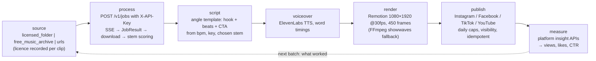
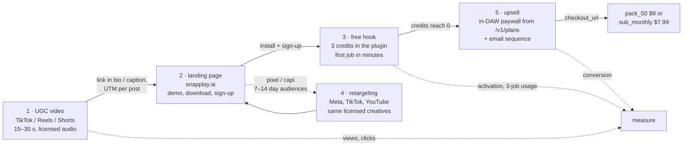

# SnapPlay AI — Growth engine

`growth/` is an automation engine that produces short-form videos showing SnapPlay AI
turning a clip into a playable instrument, publishes them, and measures what they
bring in. It drives the public API with an API key (contract §11) exactly like any
other machine client, so every clip it processes is a real, credit-metered job. It
exposes its steps as MCP tools (`growth/mcp_server`) so an operator — or a scheduled
batch — can run the pipeline one step at a time or end to end.

Read §2 before anything else. The pipeline's default behaviour is shaped by it.

## 1. Pipeline

| step | input | output | side effects |
|------|-------|--------|--------------|
| **source** | one of three providers: `licensed_folder` (audio under `LICENSED_CLIPS_DIR`, with optional `<name>.json` sidecars carrying `title`, `license`, `attribution`), `free_music_archive`, or explicit `urls` | candidate clips with their recorded licence | none — read-only |
| **process** | clip path/URL + `options` (contract §2 `options`, plus `source` and `force`) | a content item: `JobResult` (§2), local stems + MIDI, and the stem `scoring.py` picked | one credit from the key owner's balance |
| **script** | clip metadata (title, chosen stem, BPM, key, note count) + an angle | a 15 s brief: hook, timed beats, on-screen text, CTA, caption, hashtags — filled from templates, no LLM call | none |
| **voiceover** | narration text, a voice id | mp3 plus word timings from ElevenLabs `with-timestamps` | TTS provider usage |
| **render** | content item, script, voiceover, scene and presenter choice | 1080×1920 MP4, 450 frames at 30 fps, via `npx remotion render` (FFmpeg `showwaves` + `drawtext` fallback) | CPU time |
| **publish** | content item, platforms, caption, hashtags, optional `schedule_at` | per-platform post id, URL and resulting visibility | a post (private on an unaudited TikTok app, see §5); counts against the configured daily cap |
| **measure** | since-timestamp | per-post views, likes, comments, shares, impressions and a CTR, stored on the content item | none |

Everything the engine renders is derived from a job the product actually ran; there
is no faked output.

## 2. Rights: what may be used as a source

**Publishing output derived from a commercial recording as advertising is copyright
infringement.** It does not matter that the recording was separated into stems,
transposed, sliced or played back as an "instrument"; the result is a derivative work
of both the sound recording (the master) and the underlying composition, and using it
in a promotional video is a public performance, a reproduction and a synchronisation
that the rights holders have not licensed. Fair use does not cover advertising.
Platforms detect this automatically (Content ID on YouTube, Rights Manager on Meta,
TikTok's audio matching): the creative is removed, the post is muted or taken down,
repeat matches get the account restricted, and ad accounts running such creatives are
banned — usually without a route back. That outcome is worse for the brand than
publishing nothing.

Therefore:

* **`list_source_clips` never invents a licence.** The `licensed_folder` provider lists
  only what the operator put under `LICENSED_CLIPS_DIR` and reports the `license` /
  `attribution` from each clip's `<name>.json` sidecar (falling back to
  `"operator-licensed"`). The `free_music_archive` provider filters on the FMA's own
  `license_title` with `license_allows_ads()`: CC0, public domain, CC BY and CC BY-SA
  pass; anything matching NonCommercial or NoDerivatives is dropped. The `urls` provider
  records the licence as `"asserted by caller"` — it is the caller's declaration, not a
  check.
* **What the code does not do:** `process_clip` accepts whatever reference it is given
  and records the provider; there is no machine-readable permitted-uses field and no
  automatic refusal at that step. **The gate is at the source, and for the `urls`
  provider it is you.** Putting an unlicensed file in `LICENSED_CLIPS_DIR` or passing its
  URL will produce a video, and nothing downstream will stop it.
* **Acceptable sources**, in order of preference:
  1. Recordings made for this purpose by the team (full ownership).
  2. Clips commissioned from producers under a written buy-out covering advertising
     and derivative use.
  3. Public-domain and CC0 material.
  4. Royalty-free libraries whose license text explicitly allows use in paid
     advertising **and** processing into derivative works (many "royalty-free" packs
     forbid redistributing the audio as stems or samples; the video is a derivative
     work, so read the clause rather than the marketing page). Keep the license text
     and invoice next to the manifest entry.
  5. Users' own recordings, only with a written release naming advertising use.
* **Platform sound libraries are not a licence for ads.** The general TikTok /
  Instagram music libraries cover organic personal posts; business accounts are
  restricted to the commercial libraries, and API-published content that uses a
  library track is muted or rejected. The engine renders its own audio and never picks
  a platform track.
* **Attribution** (CC-BY and similar) is carried on the `SourceClip.attribution` field
  and parsed into `ClipMetadata`, but `write_brief` does **not** put it in the caption
  today: the caption `publish_video` sends is `hook + cta_line` plus the brief's
  hashtags. Where the licence requires credit, the operator must pass it in the
  `caption` argument. Treat this as a compliance step you own, not one the engine
  performs.
* **Trademarks.** DAW names and screenshots (FL Studio, Ableton Live, Logic) may appear
  to state compatibility, not to imply endorsement; the publishers' brand guidelines
  apply and their logos are not used as design elements.
* **Nothing "found".** No clips from streaming services, sample-sharing sites, other
  creators' videos, or "a song everyone knows" — including for "testing".

## 3. MCP tool surface (`growth/mcp_server`)

The server (`FastMCP("snapplay-growth")`) authenticates to the API with
`SNAPPLAY_API_KEY` from the environment (§11); it never handles user JWTs. Signatures
below are the tool schemas as registered — `growth/tests/snapshots/tools.json` is the
snapshot the test suite pins them against.

| tool | signature | what it does | guardrails that actually exist |
|------|-----------|--------------|--------------------------------|
| `list_source_clips` | `(source="licensed_folder"\|"free_music_archive"\|"urls", limit=10, urls=None)` | candidate clips with `ref`, `title`, `source`, `license`, `attribution`, `duration_seconds` | read-only; the FMA provider drops NC / ND licences (`license_allows_ads`) |
| `process_clip` | `(clip_path_or_url, options=None)` | multipart `POST /v1/jobs`, SSE follow with a polling fallback, downloads stems + MIDI, scores the stems and stores a content item | a clip already processed is returned from the store instead of re-submitted unless `options.force` is true; one credit otherwise |
| `write_script` | `(clip_metadata, angle)` — angle ∈ `speed`, `bass`, `sample_flip`, `tutorial` | a deterministic 15 s brief (hook, timed beats, on-screen text, CTA, hashtags) filled from templates | no LLM call, so no invented claims; the CTA is the fixed "3 free credits" line |
| `generate_voiceover` | `(text, voice_id=None, content_item_id=None)` | ElevenLabs `with-timestamps` → mp3 + word timings, attached to the content item when one is given | needs `ELEVENLABS_API_KEY`; `run_daily_batch` renders text-only without it |
| `render_video` | `(content_item_id, scene="plugin_ui"\|"daw", presenter="waveform"\|"avatar_clip", avatar_clip=None)` | props JSON → `npx remotion render` at 1080×1920, 450 frames @ 30 fps; FFmpeg `showwaves` + `drawtext` fallback | the audio is the content item's own clip and stems |
| `publish_video` | `(content_item_id, platforms, caption, hashtags, schedule_at=None)` | the adapters in `growth/mcp_server/publishers/` (instagram, facebook, tiktok, youtube) | idempotent per (item, platform): a repeat returns the stored post id, a failed attempt resumes from its checkpoint; TikTok posts `SELF_ONLY` and reports `status: "restricted"` |
| `report_metrics` | `(since_iso)` | per-post views, likes, comments, shares, impressions and a CTR from each platform's insight API, stored on the item | read-only |
| `run_daily_batch` | `(count=3, accounts=None, dry_run=True)` | publishes anything already due, then processes → scripts → voices → renders `count` new `licensed_folder` clips, cycling the four angles, and publishes them | `dry_run=True` is the default and skips publishing; per-platform daily caps from `GROWTH_MAX_POSTS_PER_DAY_<PLATFORM>` are counted in the store so a restart cannot exceed them |

`run_daily_batch` is the only tool a scheduler needs; the others exist so an operator can
re-run one stage (a new script for an existing item, a re-render with another scene)
without paying for another job.

**Guardrails that are policy, not code.** There is no `credit_budget` argument and no
balance floor: `run_daily_batch` will keep spending credits until it runs out of
unprocessed clips or the API answers `402`. Bound it with `count`, with the size of
`LICENSED_CLIPS_DIR`, and by topping the engine's account up deliberately (§8). Rate
limiting is likewise the API's (§5), not the engine's.

## 4. The five-touch funnel

| touch | what happens | metric |
|-------|--------------|--------|
| 1 · UGC video | the engine's post: a real clip becomes a playable instrument in under a minute of screen time | views, completion rate, link clicks |
| 2 · landing page | UTM per post; the page shows the same workflow and the download / sign-up | sessions, sign-up rate by post |
| 3 · free hook | 3 credits at signup (§3); the plugin's first-run flow gets the user to a first job fast | activation (first job), jobs per free user |
| 4 · retargeting | landing visitors who did not sign up, and free users who did not run a job, see the same creatives on paid placements | cost per sign-up, cost per activation |
| 5 · upsell | at `available = 0` the plugin shows the `/v1/plans` prompt and polls `/v1/me` (§3); an email sequence mirrors it for users who closed the plugin | free → paid conversion, pack vs sub mix |

`ECONOMICS.md` §9 puts numbers on this: reaching $135 / day needs on the order of 500
sign-ups a day at a 3 % conversion, which is what this funnel has to deliver.

Only touches 1 and 5 exist in this repository — the engine (`growth/`) and the in-plugin
paywall (`plugin/Source/PluginEditor.cpp`, driven by `/v1/plans`). The landing page,
the pixel/CAPI retargeting audiences, the email sequence and the UTM plumbing that would
connect them (§7) are not built here. The funnel is the plan; two of its five touches are
the product.

## 5. Platform constraints

| platform | publishing route | before app review / audit | quotas and rules |
|----------|------------------|---------------------------|------------------|
| **TikTok** | Content Posting API (direct post) with the `video.publish` scope | unaudited apps can only post with **private (self-only) visibility**; public posting requires the app audit | per-user daily post limits; the required posting UX (creator info, privacy choice, disclosure toggles) must be honoured even when automated; content-promotion and own-brand disclosure flags set on every post; AI-generated flag set when applicable |
| **Meta (Instagram / Facebook)** | Instagram Graph API content publishing (Reels) via a professional account linked to a Page | `instagram_content_publish` needs **advanced access through app review** | **25 API-published posts per account per 24 h**; platform rate limits per user per hour; AI-info label on synthetic media |
| **YouTube** | Data API `videos.insert` (Shorts are ordinary vertical uploads) | uploads from **unverified API projects are set to private**; the compliance audit lifts this | default **10,000 quota units / day**; `videos.insert` costs 1,600 → about 6 uploads / day per project without a quota extension; the "altered or synthetic content" disclosure at upload |
| **Ad platforms** (retargeting) | Meta / TikTok / Google ads managers | business verification | music in ads must be licensed (§2); no misleading performance claims; creatives reviewed per platform policy |

`publish_video` reports the visibility it actually obtained rather than the one
requested — an unaudited TikTok app yields `status: "restricted"` with a note, never a
claim that the post is public. The daily caps it honours are the local
`GROWTH_MAX_POSTS_PER_DAY_<PLATFORM>` settings counted in the store; the platforms' own
quotas above are not queried, so keep the local caps at or below them. During the review
period the engine still runs end to end — private posts are useful for QA — but the
funnel's touch 1 is effectively off until audits pass, and the launch plan should assume
weeks for them.

## 6. Disclosure

**None of this is implemented.** `render_video` bakes no AI label, the publishers send no
AI-generated or branded-content flag (TikTok's request carries `post_info` with a privacy
level, nothing else), and there is no `is_synthetic` field anywhere in `growth/`. Until
that changes, disclosure is an operator obligation carried out by hand — in the caption
you pass to `publish_video` and in each platform's own composer. The rules below are the
requirements the engine has to grow into; treat them as a to-do list, not as behaviour.

* **Synthetic presenters and voices must be labelled.** Anything with a TTS voiceover or
  a generated presenter needs the platform's AI-generated flag (TikTok's AI content
  label, YouTube's altered-or-synthetic disclosure at upload, Meta's AI info label) and a
  visible on-screen line. Because `generate_voiceover` is on by default in
  `run_daily_batch` whenever `ELEVENLABS_API_KEY` is set, **assume every batch output is
  synthetic** and label it.
* **No fake testimonials.** A synthetic presenter may explain the product; it may not
  claim to be a user, describe "my experience", or read a review. The FTC's rule on
  consumer reviews and testimonials prohibits fabricated or AI-generated testimonials and
  the Endorsement Guides require endorsements to reflect real experience. The shipped
  angle templates (`speed`, `bass`, `sample_flip`, `tutorial`) are written in the second
  person about the product and make no first-person user claim — keep it that way when
  adding angles.
* **Own-brand promotion is disclosed** where the platform has a flag for it (TikTok's
  disclosure toggles; "paid partnership" tools elsewhere are for third parties and are
  not used for first-party content).
* **EU audiences.** The AI Act's transparency obligations for AI-generated and
  manipulated media (Article 50, applicable since August 2026) require the same
  labelling; apply it everywhere rather than geo-targeting the label.
* **Claims are measured claims.** "2 seconds" is the A10G pipeline budget (contract §7),
  not the wall-clock a viewer experiences (`ARCHITECTURE.md` §5 puts the perceived total
  at 5–14 s); scripts say "seconds", show the real elapsed time in the recording, and
  never quote a number nobody observed.

## 7. Measurement and attribution

What `report_metrics` does today, and what it does not, are different things.

* **Implemented.** `report_metrics(since_iso)` walks the content items published since
  that timestamp, calls each platform's official insight endpoint through its adapter,
  and stores `views`, `likes`, `comments`, `shares`, `impressions` and a `ctr` on the
  item (`ctr_kind` says whether it is click-through or engagement, because the platforms
  do not report the same things). Nothing is scraped.
* **Not implemented — the funnel half.** There is no UTM tagging in the engine: no
  `utm_*` parameters are generated, and nothing joins platform insights to `profiles`,
  `jobs` or `purchases`. The caption's link is whatever the operator writes. Closing the
  loop from a post to a sign-up needs a UTM convention on the landing page and a join
  through the API — design it before the first paid batch, or the numbers in §4 are
  unmeasurable.
* The metric that *should* decide what the next batch makes is **sign-ups per 1,000
  views by angle and source clip**, followed by activation rate; views alone are not
  worth optimising. Until the previous bullet exists, only the view-side half of that
  ratio is available.

## 8. Operating limits

* The engine's API key belongs to a dedicated account whose balance is topped up
  deliberately — that top-up *is* the spend limit, because the engine has no
  `credit_budget` or balance floor of its own (§3). The key can be revoked with
  `DELETE /v1/api-keys/{id}` (§11).
* It is subject to the same rate limits as any user (§5): 10 submissions / minute,
  60 reads / minute. A batch of 20 clips takes minutes, not seconds, by design.
* The key is read from the environment only; it appears in no log, config file or
  rendered video metadata.
* CI runs the engine against platform APIs mocked with respx; no test reaches the
  network. Real publishing needs the accounts, app reviews and audits in §5, none of
  which can be exercised from this repository.
